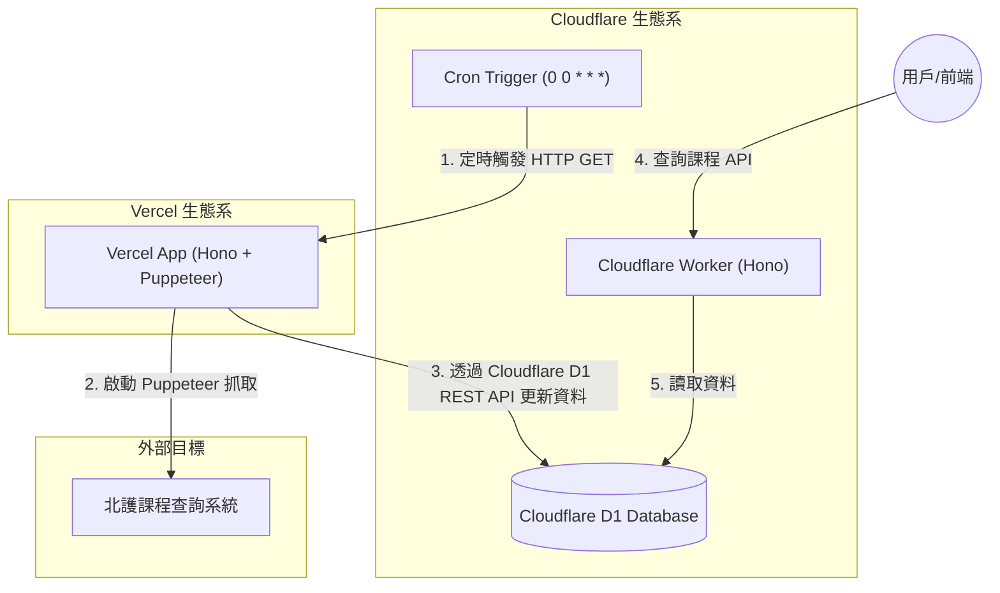

# NTUNHS Course Crawler

這是執行瀏覽器自動化爬蟲用於抓取國立臺北護理健康大學 (NTUNHS, 北護, 國北護) 的課程資料的專案

## 本地執行版本

在目前目錄的 `index.js` 是本地執行版本

### 安裝依賴

```bash
pnpm install
```

### 執行

```bash
node index.js
```

執行後，你應該就會看到開啟瀏覽器自動化爬蟲的過程

完成後，終端機會出現 `done` 字樣，且目錄下會產生 `courses.json` 檔案，內容為抓取到的課程資料

## 部屬架構



## Cloudflare Worker

使用 CRON Trigger 每天凌晨呼叫 vercel app 的 `/api/v1/crawler` 端點，來執行爬蟲

請參考 `browser-worker` 目錄的 [README.md](browser-worker/README.md) 來部屬 Cloudflare Worker

## Vercel App

- 使用 puppeteer 來抓取課程資料 (@sparticuz/chromium)
- 使用 vercel blob 來存放 chromium 執行環境 (避免每次都重新下載)

請參考 `vercel-app` 目錄的 [README.md](vercel-app/README.md) 來部屬 Vercel App